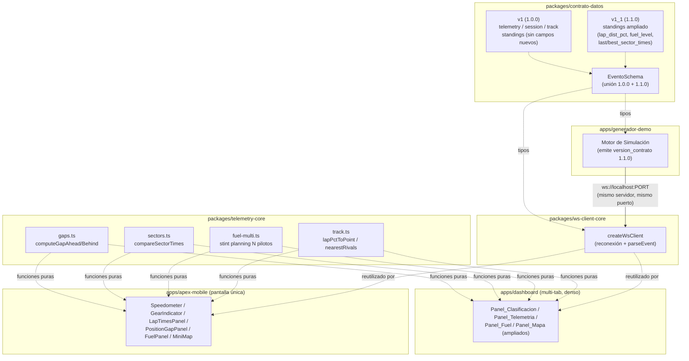
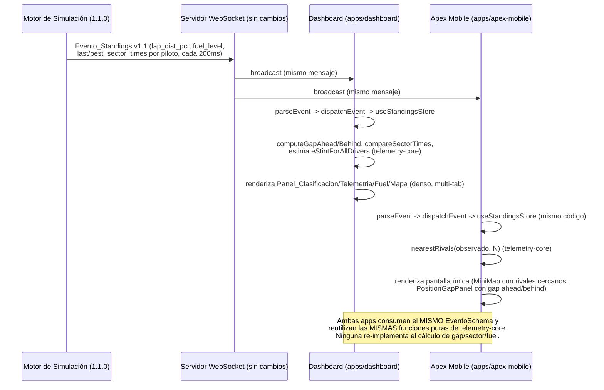

# Design Document: Apex Mobile & Dashboard Expansion

## Overview

Esta especificación amplía la plataforma de telemetría iRacing en dos frentes simultáneos: (1) el Race Engineer Dashboard existente gana densidad de datos (gap adelante/atrás, comparativa de sectores entre rivales, stint/fuel planning multi-piloto), y (2) se construye desde cero **Apex Mobile**, una PWA de pantalla única (sin tabs) para el piloto mientras maneja. Ambos frentes comparten una única ampliación aditiva y retrocompatible del Contrato_Datos (v1.1.0) que añade datos por-piloto a `Evento_Standings`, y comparten paquetes de lógica pura (`packages/telemetry-core`, `packages/ws-client-core`) para maximizar portabilidad de código entre las dos apps.

## Arquitectura de Monorepo (actualizada)

```
apex-iracing/
├── packages/
│   ├── contrato-datos/            # v1 (1.0.0) sin cambios + v1_1 (1.1.0, aditivo)
│   │   └── src/
│   │       ├── v1/                 # sin cambios respecto al spec anterior
│   │       └── v1_1/               # NUEVO: extensión aditiva de standings
│   │           ├── standings.ts    # StandingsEntryV1_1 / StandingsEventV1_1
│   │           ├── evento.ts       # EventoSchema unión de 1.0.0 + 1.1.0
│   │           └── parse.ts        # parseEvent actualizado (dispatch por versión)
│   ├── telemetry-core/             # NUEVO: view-models puros compartidos
│   │   └── src/
│   │       ├── gaps.ts             # computeGapAhead / computeGapBehind
│   │       ├── sectors.ts          # compareSectorTimes (rival vs rival)
│   │       ├── fuel-multi.ts       # multi-driver fuel/stint (generaliza fuel.ts v1)
│   │       ├── track.ts            # lapPctToPoint / getSectorForLapPct / nearestRivals
│   │       └── fuel.ts             # re-export de fuel.ts (movido desde dashboard)
│   └── ws-client-core/             # NUEVO: cliente WS framework-agnostic compartido
│       └── src/
│           └── client.ts           # createWsClient (extraído de apps/dashboard)
├── apps/
│   ├── generador-demo/             # AMPLIADO: emite version_contrato "1.1.0"
│   │   └── src/simulation/
│   │       ├── events.ts           # buildStandingsEvent ahora puebla campos v1.1
│   │       └── state.ts            # DriverState: sin campos nuevos (ver Nota A)
│   ├── dashboard/                  # AMPLIADO: nuevos datos en paneles existentes
│   │   └── components/panels/
│   │       ├── PanelClasificacion.tsx   # + columnas gap_ahead/gap_behind
│   │       ├── PanelTelemetria.tsx      # + comparativa de sectores entre rivales
│   │       ├── PanelFuel.tsx            # + stint planning multi-piloto
│   │       └── PanelMapa.tsx            # + posición de todos los pilotos
│   └── apex-mobile/                 # NUEVO: PWA Next.js + next-pwa, pantalla única
│       ├── app/
│       │   ├── layout.tsx           # registra el Service Worker (next-pwa)
│       │   ├── page.tsx             # ÚNICA pantalla, sin tabs/routing interno
│       │   └── manifest.ts          # Web App Manifest (PWA)
│       ├── components/
│       │   ├── Speedometer.tsx      # velocímetro circular + RPM/shift lights
│       │   ├── GearIndicator.tsx
│       │   ├── LapTimesPanel.tsx    # actual / mejor / delta
│       │   ├── PositionGapPanel.tsx # posición + gap adelante/atrás
│       │   ├── FuelPanel.tsx        # combustible + vueltas estimadas
│       │   └── MiniMap.tsx          # trazado + posición propia + rivales cercanos
│       ├── lib/                     # store/ws-client específicos de Apex Mobile
│       │   ├── store/               # mismos 4 stores Zustand (telemetry/standings/session/track)
│       │   └── ws-client.ts         # instancia createWsClient (de ws-client-core)
│       ├── next.config.ts           # withPWA(...) de next-pwa
│       └── package.json
├── package.json                     # workspaces (ya incluye "apps/*" y "packages/*")
└── tsconfig.base.json
```

**Nota A (decisión de diseño — por qué NO se añade un campo `estimated_pit_lap` al contrato):** la estimación de vueltas restantes hasta la próxima parada de CADA piloto se calcula enteramente en el cliente (`packages/telemetry-core/fuel-multi.ts`), reutilizando la misma técnica que `PanelFuel.tsx` ya usa para el piloto observado: se detecta el cruce de línea de meta de un piloto por el cambio de su propio `last_lap_time` (campo YA presente en `StandingsEntryV1` desde v1.0.0) y se muestrea su `fuel_level` (nuevo en v1.1) en ese instante. Esto evita ampliar el motor de simulación con un contador de vueltas por piloto y mantiene el contrato mínimo: solo se añaden campos que genuinamente no se pueden derivar de datos existentes.

**Nota B (por qué `apps/apex-mobile` usa Next.js + next-pwa):** decisión explícita del usuario de mantener el mismo framework que `apps/dashboard`, priorizando consistencia de herramientas en el monorepo (mismo compilador, mismo linter, mismo patrón de imports de `@apex/*`) por sobre el bundle mínimo que ofrecería Vite. El costo (bundle más pesado, App Router/SSR que no se usa realmente ya que la pantalla es 100% cliente) se acepta a cambio de portabilidad de configuración y de componentes entre ambas apps.

## Architecture



## Flujo de datos (Mermaid sequence) — dos consumidores del mismo servidor



## Components and Interfaces

| Componente | Paquete/App | Responsabilidad |
|---|---|---|
| `v1_1` (esquemas Zod) | `packages/contrato-datos` | Define `StandingsEntryV1_1`/`StandingsEventV1_1` y actualiza `parseEvent` para despachar por `version_contrato` exacto entre 1.0.0 y 1.1.0. |
| `telemetry-core` | `packages/telemetry-core` | Funciones puras compartidas: `computeGaps`, `compareSectorTimes`, `estimateStintForAllDrivers`, `nearestRivals`, `lapPctToPoint`/`getSectorForLapPct` (movidas desde `apps/dashboard`), `estimateRemainingLaps`/`deriveFuelConsumptionRate` (movidas desde `apps/dashboard`). Sin dependencias de React ni de ningún framework. |
| `ws-client-core` | `packages/ws-client-core` | Cliente WebSocket con reconexión + `parseEvent`, extraído de `apps/dashboard/lib/ws-client` para que ambas apps consuman la misma implementación. |
| Motor de simulación ampliado | `apps/generador-demo` | `recordSectorCompletion` (nuevo) + `buildStandingsEvent` actualizado para poblar los 4 campos nuevos y emitir `version_contrato: "1.1.0"`. |
| Paneles ampliados | `apps/dashboard` | `Panel_Clasificacion` (gap ahead/behind), `Panel_Telemetria` (comparativa de sectores), `Panel_Fuel` (stint multi-piloto), `Panel_Mapa` (todos los pilotos). |
| Pantalla única | `apps/apex-mobile` | `Speedometer`, `GearIndicator`, `LapTimesPanel`, `PositionGapPanel`, `FuelPanel`, `MiniMap` — todos montados simultáneamente en `app/page.tsx`, sin router interno ni tabs. |

## Data Models

Los modelos de datos nuevos son los esquemas Zod de `v1_1` descritos en la sección siguiente (`StandingsEntryV1_1`, `StandingsEventV1_1`) y los tipos de vista de `telemetry-core` (`DriverGaps`, `SectorComparison`, `DriverStintEstimate`), ambos detallados con su forma completa en "Core Interfaces/Types" más abajo. No se introducen nuevos modelos de dominio interno en `apps/generador-demo` más allá de los campos añadidos a `DriverState` (`currentSectorIndex`, `currentSectorStartLapTime`, `lastSectorTimes`, `bestSectorTimes`), documentados en "Migración del Generador_Demo".

## Ampliación versionada del Contrato_Datos: v1.1.0

### Decisión de versionado

Se elige **1.1.0** (minor bump en semver, no un nuevo namespace `v2`) porque el cambio es **estrictamente aditivo**: se agregan campos nuevos y opcionales-por-diseño a `Evento_Standings`; ningún campo existente de `telemetry`, `session`, `track` ni de los campos ya existentes de `standings` cambia de tipo, se elimina, o cambia de significado. Esto permite que:

- Un consumidor que solo entiende 1.0.0 (hipotético, no existe en este monorepo pero es la garantía que exige el Requisito 5 del spec anterior) pueda seguir procesando los campos que ya conocía si se relajara la comprobación estricta de versión — aunque en la implementación real, `isSupportedVersion` sigue tratando cada string de versión como un valor exacto soportado o no (ver más abajo, "Compatibilidad hacia atrás").
- El Generador_Demo, al pasar a emitir siempre `version_contrato: "1.1.0"`, no rompe ninguna validación Zod existente de los campos v1.0.0: el esquema 1.1.0 es un `.extend()` del esquema 1.0.0 de standings, nunca un `.omit()` ni un cambio de tipo.

**Regla de versionado adoptada para este paquete** (documentada explícitamente porque no existía antes de esta expansión): `SUPPORTED_CONTRACT_VERSIONS` pasa a incluir AMBAS `"1.0.0"` y `"1.1.0"` como versiones soportadas simultáneamente. `parseEvent` despacha el payload al esquema Zod correspondiente a su `version_contrato` exacto:

- `version_contrato: "1.0.0"` → valida contra `StandingsEventV1Schema` (forma original, sin los campos nuevos).
- `version_contrato: "1.1.0"` → valida contra `StandingsEventV1_1Schema` (forma ampliada).
- `telemetry` / `session` / `track` con `version_contrato: "1.1.0"` → validan contra los MISMOS esquemas 1.0.0 (no cambian; solo se les permite declarar la versión de contrato 1.1.0 porque el envelope no cambió).
- Cualquier otro `version_contrato` (p. ej. `"2.0.0"`, `"0.9.0"`, cadenas arbitrarias) → `unsupported_version`, exactamente como antes.

Esto preserva el Requisito 5.4 del spec anterior ("SHALL especificar que dicho mensaje debe poder identificarse como incompatible antes de su procesamiento") sin reinterpretarlo: un mensaje con versión no soportada sigue siendo rechazado antes de tocar su payload, ahora sobre un conjunto de versiones soportadas más amplio.

### Nuevos campos en `StandingsEntryV1_1`

```pascal
STRUCTURE SectorTimesV1_1
  { -- Array de longitud fija = número de sectores del Evento_Track de la sesión.
    -- Cada posición i corresponde al sector con index = i.
    -- null en la posición i significa "el piloto no ha completado el sector i
    -- en la vuelta correspondiente todavía" (p. ej. arranque de sesión).
  }
  sector_times: ARRAY OF (NUMBER OR NULL)
END STRUCTURE

STRUCTURE StandingsEntryV1_1 EXTENDS StandingsEntryV1
  -- Campos heredados sin cambios: driver_id, position, class_id, gap,
  -- last_lap_time, best_lap_time, in_pits, off_track.

  -- NUEVOS campos (todos requeridos en 1.1.0; el evento completo, no
  -- por-campo, es lo que está versionado):
  lap_dist_pct: NUMBER            -- [0, 1), progreso de vuelta del piloto.
                                    -- Habilita Panel_Mapa/MiniMap multi-piloto
                                    -- y "rivales cercanos" (Frente 2).
  fuel_level: NUMBER              -- >= 0. Habilita stint planning multi-piloto
                                    -- (Frente 1) sin ampliar Evento_Telemetry.
  last_sector_times: SectorTimesV1_1   -- tiempos de sector de la última
                                          -- vuelta completada por el piloto.
  best_sector_times: SectorTimesV1_1   -- mejores tiempos de sector
                                          -- registrados por el piloto en la sesión.
END STRUCTURE

STRUCTURE StandingsEventV1_1 EXTENDS StandingsEventV1
  type: "standings"                -- sin cambios, sigue siendo el discriminante
  version_contrato: "1.1.0"         -- literal, distingue de StandingsEventV1Schema
  drivers: ARRAY OF StandingsEntryV1_1
END STRUCTURE
```

**Por qué `gap` NO se reemplaza por `gap_ahead`/`gap_behind` en el contrato:** se evaluaron dos opciones (ver contexto del usuario) — ampliar el contrato con campos explícitos, o calcular gap_ahead/gap_behind en el view-model a partir del orden de posiciones. Se elige la segunda: el array `drivers` de `Evento_Standings` YA contiene, para cada piloto, su `position` y su `gap` (al líder). Dado que los pilotos están implícitamente ordenables por `position`, el gap de un piloto respecto al piloto inmediatamente delante/detrás es una resta simple de sus respectivos `gap` al líder (`gap_ahead(P) = gap(P) - gap(delante_de_P)`), siempre que ambos pilotos compartan la misma clase de referencia de tiempo (ver función `computeGapAhead`/`computeGapBehind` más abajo, que documenta el caso multi-clase). Ampliar el contrato con dos campos derivables de datos ya presentes violaría el principio de "el contrato solo transporta lo que no se puede derivar" ya establecido implícitamente por el spec anterior (p. ej. `delta_to_prev`/`delta_to_best` sí están en el contrato porque el motor los conoce con precisión que el cliente no puede reconstruir; gap_ahead/gap_behind sí se puede reconstruir con precisión exacta a partir de `gap` + `position`).

**Por qué `sector_times` SÍ se añade al contrato (y no se deriva):** a diferencia del gap, los tiempos de sector de un piloto no observado no son derivables por el cliente a partir de ningún campo ya existente en `Evento_Standings` v1.0.0 — el cliente nunca recibe telemetría cruda (throttle/brake/lap_dist_pct instantáneo) de los rivales, solo del piloto observado. El motor de simulación, en cambio, sí conoce internamente el progreso de cada piloto en cada tick (es el mismo dato que usa para `recomputePositions`), por lo que es la única fuente capaz de producir tiempos de sector por piloto. Este es exactamente el mismo criterio de diseño que ya justificaba la existencia de `delta_to_best`/`delta_to_prev` en el contrato v1.0.0 original.

### Migración del Generador_Demo (`apps/generador-demo`)

```pascal
-- state.ts: DriverState se amplía con campos INTERNOS (no expuestos
-- directamente; se proyectan a StandingsEntryV1_1 vía buildStandingsEvent).
STRUCTURE DriverState  -- (extiende el DriverState v1.0.0 ya existente)
  ... -- todos los campos existentes sin cambios
  currentSectorIndex: INTEGER          -- sector en curso, para detectar
                                          -- transición de sector.
  currentSectorStartLapTime: NUMBER    -- currentLapTime al entrar al sector actual.
  lastSectorTimes: ARRAY OF (NUMBER OR NULL)   -- long. = sectors.length, todo null al inicio.
  bestSectorTimes: ARRAY OF (NUMBER OR NULL)   -- long. = sectors.length, todo null al inicio.
END STRUCTURE

-- lap.ts / nuevo módulo sectors.ts: se detecta la transición de sector en
-- cada tick comparando getSectorForLapPct(sectors, lapDistPct_anterior) vs
-- getSectorForLapPct(sectors, lapDistPct_nuevo) -- la MISMA función pura
-- ya existente en apps/dashboard/lib/view-models/track.ts, ahora movida a
-- packages/telemetry-core/track.ts para que el motor de simulación
-- también pueda importarla sin duplicar la lógica de sectorización.

ALGORITHM recordSectorCompletion(driver, sectorsDef, dtMs)
INPUT: driver de tipo DriverState, sectorsDef, dtMs
OUTPUT: DriverState actualizado

BEGIN
  previousSector ← getSectorForLapPct(sectorsDef, driver.lapDistPct)
  -- (advanceLap ya se aplicó antes de esta función en el pipeline del tick)
  newSector ← getSectorForLapPct(sectorsDef, driver.lapDistPctDespuesDeAdvance)

  IF newSector != previousSector THEN
    sectorTime ← driver.currentLapTime - driver.currentSectorStartLapTime
    newLastSectorTimes ← copiar driver.lastSectorTimes
    newLastSectorTimes[previousSector] ← sectorTime

    newBestSectorTimes ← copiar driver.bestSectorTimes
    IF newBestSectorTimes[previousSector] = NULL OR sectorTime < newBestSectorTimes[previousSector] THEN
      newBestSectorTimes[previousSector] ← sectorTime
    END IF

    RETURN driver CON lastSectorTimes = newLastSectorTimes,
                      bestSectorTimes = newBestSectorTimes,
                      currentSectorIndex = newSector,
                      currentSectorStartLapTime = driver.currentLapTime
  END IF

  RETURN driver  -- sin cambios de sector en este tick
END
```

```pascal
-- events.ts: buildStandingsEvent pasa a construir StandingsEntryV1_1
-- (todas las derivaciones de v1.0.0 -- gap, off_track placeholder, etc. --
-- se preservan sin cambios; solo se añaden los 4 campos nuevos).
ALGORITHM buildStandingsEvent(state, timestamp)
INPUT: state de tipo SessionState, timestamp
OUTPUT: StandingsEventV1_1

BEGIN
  leader ← buscar piloto con position = 1 en state.drivers
  leaderLapDistPct ← leader.lapDistPct SI leader existe, si no 0

  drivers ← []
  FOR each driver IN state.drivers DO
    gap ← MAX(0, (leaderLapDistPct - driver.lapDistPct) * REFERENCE_LAP_DURATION_S)
    entry ← {
      driver_id: driver.driverId,
      position: driver.position,
      class_id: driver.classId,
      gap: gap,
      last_lap_time: driver.lastLapTime,
      best_lap_time: driver.bestLapTime,
      in_pits: driver.inPits,
      off_track: false,
      -- NUEVOS campos v1.1.0:
      lap_dist_pct: driver.lapDistPct,
      fuel_level: driver.fuelLevel,
      last_sector_times: driver.lastSectorTimes,
      best_sector_times: driver.bestSectorTimes,
    }
    drivers.append(entry)
  END FOR

  RETURN {
    type: "standings",
    version_contrato: "1.1.0",   -- CAMBIA de "1.0.0" a "1.1.0"
    timestamp: timestamp,
    drivers: drivers,
  }
END
```

### Compatibilidad hacia atrás — matriz de casos

| Emisor | version_contrato emitido | Consumidor | Resultado |
|---|---|---|---|
| Generador_Demo (post-expansión) | `"1.1.0"` en TODOS los eventos (telemetry/standings/session/track) | Dashboard/Apex Mobile (post-expansión) | `parseEvent` reconoce `"1.1.0"` como soportada; `standings` valida contra `StandingsEventV1_1Schema`; el resto valida contra los esquemas 1.0.0 sin cambios. |
| Generador_Demo (post-expansión) | `"1.1.0"` | Un consumidor hipotético que SOLO soporta `"1.0.0"` (`SUPPORTED_CONTRACT_VERSIONS = ["1.0.0"]`) | El mensaje se clasifica como `unsupported_version` y se descarta ANTES de intentar interpretar el payload — el consumidor antiguo simplemente deja de recibir datos en vez de recibir un evento parcialmente entendido. Este es el comportamiento ya especificado por el Requisito 5.4 del spec anterior; no se introduce parsing "best-effort" de campos parciales porque el spec original nunca lo exigió. |
| Un emisor hipotético que todavía emite `"1.0.0"` (p. ej. un test o un futuro bridge no migrado) | `"1.0.0"` | Dashboard/Apex Mobile (post-expansión) | `parseEvent` reconoce `"1.0.0"` como soportada (sigue en `SUPPORTED_CONTRACT_VERSIONS`); `standings` valida contra `StandingsEventV1Schema` (forma original, SIN los 4 campos nuevos). Los view-models de `telemetry-core` que dependen de esos campos (gap_ahead/behind sí funcionan porque solo usan `position`+`gap`; `compareSectorTimes`/`nearestRivals`/stint multi-piloto NO tienen datos y devuelven su valor de "dato no disponible" explícito — ver Property de "Degradación explícita ante standings v1.0.0", más abajo). |

Esta matriz reemplaza needs de una migración "big bang": el Generador_Demo de este monorepo se actualiza para emitir siempre 1.1.0 (no hay necesidad de mantenerlo emitiendo 1.0.0 en paralelo, dado que es la única fuente de datos de todo el sistema), pero el paquete `contrato-datos` en sí sigue siendo capaz de validar ambas versiones, preservando la garantía de portabilidad hacia consumidores/emisores que no se actualicen al mismo tiempo (Requisito 5 del spec anterior).

## Core Interfaces/Types (packages/telemetry-core)

```typescript
// packages/telemetry-core/src/gaps.ts
import type { StandingsEntryV1_1 } from "@apex/contrato-datos";

export interface DriverGaps {
  driverId: string;
  /** Segundos respecto al piloto inmediatamente delante, o null si es el líder de su clase de referencia. */
  gapAhead: number | null;
  /** Segundos respecto al piloto inmediatamente detrás, o null si es el último. */
  gapBehind: number | null;
}

// packages/telemetry-core/src/sectors.ts
export interface SectorComparison {
  sectorIndex: number;
  /** Tiempo del piloto de referencia (observado) en ese sector, o null. */
  referenceTime: number | null;
  /** Tiempo del rival en ese sector, o null si no disponible. */
  rivalTime: number | null;
  /** rivalTime - referenceTime, o null si cualquiera de los dos es null. */
  deltaSeconds: number | null;
}

// packages/telemetry-core/src/fuel-multi.ts
export interface DriverStintEstimate {
  driverId: string;
  /** Igual semántica que estimateRemainingLaps (v1.0.0): puede ser Infinity. */
  estimatedRemainingLaps: number;
  /** Vuelta relativa (0 = vuelta actual, 1 = próxima, ...) en la que se estima que el piloto deba entrar a pits. Null si estimatedRemainingLaps es Infinity. */
  estimatedPitInLapsFromNow: number | null;
}
```

## Key Functions with Formal Specifications

### Function 1: computeGapAhead / computeGapBehind

```typescript
// packages/telemetry-core/src/gaps.ts
function computeGaps(drivers: StandingsEntryV1_1[]): DriverGaps[]
```

**Preconditions:**
- `drivers` es un array (posiblemente vacío) de `StandingsEntryV1_1`.
- Todo elemento de `drivers` tiene un `position` entero positivo.
- No hay dos elementos con el mismo `position` (garantizado por Property 8 del spec anterior, ya validada sobre el motor de simulación).

**Postconditions:**
- El resultado tiene exactamente `drivers.length` elementos, uno por `driverId` de entrada (biyección).
- Para el piloto con `position` mínima (el líder), `gapAhead === null`.
- Para el piloto con `position` máxima (el último), `gapBehind === null`.
- Para cualquier otro piloto P con el piloto A inmediatamente delante (misma `class_id` o no — el cálculo es sobre el orden global de `position`, no separado por clase, replicando el comportamiento de `gap` en v1.0.0 que tampoco distinguía clase): `gapAhead(P) === gap(P) - gap(A)`, siempre `>= 0` dado que `gap` es monótono no decreciente con `position` en cualquier Evento_Standings válido.
- `gapBehind(P) === gapAhead(siguiente piloto por position)` — es decir, es una relación simétrica: el gap_behind de un piloto es exactamente el gap_ahead del piloto detrás de él, nunca se calculan de forma independiente ni pueden divergir.
- Función pura: no muta `drivers`.

**Loop Invariants:**
- Al recorrer `drivers` ordenados por `position` ascendente en una sola pasada, en cualquier punto de la iteración, todos los `gapAhead` ya calculados son correctos respecto al piloto inmediatamente anterior en esa misma pasada.

### Function 2: compareSectorTimes

```typescript
// packages/telemetry-core/src/sectors.ts
function compareSectorTimes(
  referenceLastSectorTimes: (number | null)[],
  rivalLastSectorTimes: (number | null)[]
): SectorComparison[]
```

**Preconditions:**
- `referenceLastSectorTimes.length === rivalLastSectorTimes.length` (ambos derivados del mismo `Evento_Track.sectors`, por lo tanto de igual longitud; si no lo son, ver Postcondición de error abajo).

**Postconditions:**
- Si las longitudes coinciden: el resultado tiene exactamente esa longitud, y para cada índice i: `referenceTime = referenceLastSectorTimes[i]`, `rivalTime = rivalLastSectorTimes[i]`, `deltaSeconds = rivalTime - referenceTime` si AMBOS son no-null, si no `deltaSeconds = null`. Nunca se produce `NaN` (la resta solo ocurre cuando ambos operandos están garantizados no-null).
- Si las longitudes NO coinciden: la función lanza un `Error` descriptivo (estado inconsistente entre motor y consumidor que indica una sesión corrupta o un `Evento_Track` desincronizado; no se intenta una comparación parcial silenciosa que podría inducir a una decisión de carrera errónea).
- Función pura: no muta ninguno de los arrays de entrada.

**Loop Invariants:**
- Para cualquier prefijo de longitud k ya procesado, cada `SectorComparison` en ese prefijo satisface la postcondición de forma independiente del resto (no hay estado acumulado entre iteraciones).

### Function 3: estimateStintForAllDrivers

```typescript
// packages/telemetry-core/src/fuel-multi.ts
function estimateStintForAllDrivers(
  driversFuelHistory: Map<string, number[]>,
  currentFuelLevels: Map<string, number>
): DriverStintEstimate[]
```

**Preconditions:**
- `currentFuelLevels` contiene una entrada para cada `driverId` presente en `driversFuelHistory` (y viceversa) — dominio idéntico entre ambos mapas.
- Todo valor de `currentFuelLevels` es `>= 0` (garantizado por el contrato: `fuel_level >= 0`).
- Todo array en `driversFuelHistory` contiene únicamente valores `>= 0`, en el orden en que fueron muestreados (uno por vuelta completada, mismo formato que `deriveFuelConsumptionRate` de v1.0.0).

**Postconditions:**
- El resultado tiene exactamente una entrada por `driverId` del dominio de `currentFuelLevels`.
- `estimatedRemainingLaps` se calcula reutilizando exactamente `estimateRemainingLaps(fuelLevel, deriveFuelConsumptionRate(history))` — las mismas dos funciones puras ya existentes de v1.0.0 (movidas a `telemetry-core/fuel.ts` sin alterar su comportamiento ni su firma), aplicadas individualmente por piloto. Por transitividad de las garantías ya probadas de esas funciones (Property 13 del spec anterior), `estimatedRemainingLaps` SHALL ser siempre `>= 0` y nunca lanza excepción.
- `estimatedPitInLapsFromNow === null` si y solo si `estimatedRemainingLaps === Infinity`.
- Si `estimatedRemainingLaps` es finito, `estimatedPitInLapsFromNow === Math.floor(estimatedRemainingLaps)` (la vuelta relativa en la que el combustible llegaría a 0 si el ritmo de consumo se mantiene constante).
- Función pura: no muta `driversFuelHistory` ni `currentFuelLevels`.

**Loop Invariants:**
- Al iterar sobre las entradas de `currentFuelLevels`, el cálculo de cada `DriverStintEstimate` es independiente del de cualquier otro piloto ya procesado (no hay estado compartido entre iteraciones, cada piloto se resuelve con su propio historial).

### Function 4: nearestRivals (para MiniMap de Apex Mobile)

```typescript
// packages/telemetry-core/src/track.ts
function nearestRivals(
  observedDriverId: string,
  drivers: StandingsEntryV1_1[],
  maxCount: number
): StandingsEntryV1_1[]
```

**Preconditions:**
- `drivers` contiene como máximo un elemento con `driver_id === observedDriverId`.
- `maxCount >= 0`.

**Postconditions:**
- El resultado NUNCA incluye al piloto con `driver_id === observedDriverId`.
- El resultado tiene como máximo `min(maxCount, drivers.length - 1)` elementos (o `drivers.length` si el observado no está presente en `drivers`).
- Los elementos del resultado están ordenados por distancia circular absoluta de `lap_dist_pct` respecto al piloto observado ascendente (el rival con `lap_dist_pct` más cercano al del observado, considerando el trazado como un círculo donde 0.99 y 0.01 están cerca entre sí, aparece primero).
- Función pura: no muta `drivers`.

**Loop Invariants:**
- Tras ordenar todos los candidatos por distancia circular y tomar los primeros `maxCount`, ningún candidato descartado tiene una distancia circular estrictamente menor que cualquier candidato incluido (propiedad de un top-k correcto).

## Algorithmic Pseudocode

### Algoritmo principal: computeGaps (implementación completa)

```pascal
ALGORITHM computeGaps(drivers)
INPUT: drivers, ARRAY de StandingsEntryV1_1
OUTPUT: ARRAY de DriverGaps

BEGIN
  ASSERT no hay dos elementos en drivers con el mismo position

  sorted ← copiar drivers y ordenar por position ASCENDENTE
  result ← []

  FOR i FROM 0 TO length(sorted) - 1 DO
    current ← sorted[i]

    gapAhead ← NULL
    IF i > 0 THEN
      ahead ← sorted[i - 1]
      gapAhead ← current.gap - ahead.gap
      ASSERT gapAhead >= 0   -- invariante: gap es monótono no decreciente con position
    END IF

    gapBehind ← NULL
    IF i < length(sorted) - 1 THEN
      behind ← sorted[i + 1]
      gapBehind ← behind.gap - current.gap
    END IF

    result.append({ driverId: current.driver_id, gapAhead: gapAhead, gapBehind: gapBehind })
  END FOR

  RETURN result
END
```

**Preconditions:** ver Function 1 arriba.
**Postconditions:** ver Function 1 arriba.
**Loop Invariants:** en cada iteración i, `result[0..i-1]` ya satisface la relación de simetría `gapBehind(sorted[i-1]) === gapAhead(sorted[i])` respecto al elemento actual, verificable porque ambos se derivan de la misma resta `current.gap - ahead.gap` calculada una sola vez por par adyacente.

### Algoritmo: nearestRivals (distancia circular)

```pascal
ALGORITHM nearestRivals(observedDriverId, drivers, maxCount)
INPUT: observedDriverId, drivers ARRAY de StandingsEntryV1_1, maxCount
OUTPUT: ARRAY de StandingsEntryV1_1, longitud <= maxCount

BEGIN
  observed ← buscar en drivers con driver_id = observedDriverId
  IF observed = NULL THEN
    RETURN primeros maxCount elementos de drivers (sin poder calcular distancia)
  END IF

  candidates ← drivers FILTRADO EXCLUYENDO driver_id = observedDriverId

  FOR each rival IN candidates DO
    raw ← ABS(rival.lap_dist_pct - observed.lap_dist_pct)
    rival.circularDistance ← MIN(raw, 1 - raw)   -- distancia en el círculo [0,1)
  END FOR

  sorted ← ordenar candidates por circularDistance ASCENDENTE
  RETURN primeros maxCount elementos de sorted
END
```

**Preconditions/Postconditions/Loop Invariants:** ver Function 4 arriba.

## Diseño de UI — Frente 1: Race Engineer Dashboard (más denso)

- **Panel_Clasificacion**: se agregan columnas `Gap Adelante` / `Gap Atrás` (junto al `Gap` al líder ya existente, que se conserva) usando `computeGaps`. Se agrega un indicador visual compacto de mejor/peor sector reciente por piloto (comparando `last_sector_times` contra `best_sector_times` propio, por piloto — sin necesitar al observado).
- **Panel_Telemetria**: se agrega un sub-panel "Comparativa de Rivales": un selector permite elegir un rival de la tabla de standings; se invoca `compareSectorTimes(observado.last_sector_times, rival.last_sector_times)` y se muestra el delta por sector con color (verde/rojo) junto al trace de throttle/brake existente del piloto observado (que NO cambia — sigue siendo solo del observado, según la Decisión 1 confirmada).
- **Panel_Fuel**: pasa de mostrar solo al piloto observado a una tabla de stint planning con una fila por piloto (`estimateStintForAllDrivers`), mostrando combustible actual, vueltas restantes estimadas y la vuelta relativa estimada de próxima entrada a pits, ordenable por urgencia (menor `estimatedRemainingLaps` primero).
- **Panel_Mapa**: además del piloto observado, se dibujan todos los pilotos de `Evento_Standings` sobre el trazado usando `lap_dist_pct` (ya presente en v1.1.0), reutilizando `lapPctToPoint` sin cambios.

## Diseño de UI — Frente 2: Apex Mobile (pantalla única, sin tabs)

```pascal
-- Layout de la pantalla única (portrait), de arriba a abajo:
SCREEN ApexMobileMain
  REGION superior:
    Speedometer (circular, grande) CON RPM_shift_lights SUPERPUESTO
    GearIndicator (centro del velocímetro)
  REGION media:
    LapTimesPanel: tiempo_vuelta_actual | mejor_vuelta | delta_a_anterior | delta_a_optima
    PositionGapPanel: posicion | gap_adelante | gap_atras   -- vía computeGaps
  REGION inferior:
    FuelPanel: combustible_restante | vueltas_estimadas      -- vía estimateRemainingLaps
    MiniMap: trazado + posición propia + nearestRivals(observado, drivers, 3)
END SCREEN

-- En landscape: mismas regiones reorganizadas en 2 columnas
-- (velocímetro+marcha a la izquierda, resto de paneles a la derecha),
-- SIN introducir tabs ni navegación -- ambas orientaciones muestran
-- exactamente el mismo conjunto de datos, solo reflowed vía CSS Grid.
```

**Estética (Apex Mobile, distinta de Dashboard):** fondo `oklch(0.12 0 0)` (casi negro), acento primario cian neón `oklch(0.75 0.15 195)`, tipografía condensada (`font-mono` con `letter-spacing: -0.02em` o una fuente condensada tipo "Chakra Petch"), tamaños de fuente mínimos de 24px para valores críticos (velocidad, marcha) para legibilidad a distancia — a diferencia del Dashboard que puede usar tamaños más pequeños porque se ve de cerca y en una segunda pantalla estática. Ningún elemento requiere scroll ni tabs: todo el contenido cabe en una sola vista (`100vh`/`100dvh`) tanto en portrait como landscape.

**Shift lights:** franja de LEDs simulados sobre el velocímetro que cambia de color (verde → amarillo → rojo → parpadeo) según `rpm` respecto a un umbral de RPM óptimo de cambio, derivado como un porcentaje fijo del rango `[1000, 7000]` ya usado por el Generador_Demo (no requiere ningún campo nuevo de contrato: es una función pura de presentación sobre `rpm`, ver `packages/telemetry-core` — no se agrega a esta librería porque es puramente de renderizado, no un cálculo de dominio; vive directamente en `apps/apex-mobile/components/Speedometer.tsx`).

## Example Usage

```typescript
// apps/dashboard/components/panels/PanelClasificacion.tsx (extensión)
import { computeGaps } from "@apex/telemetry-core";

const gaps = computeGaps(latestStandingsEvent.drivers);
const gapForDriver = gaps.find((g) => g.driverId === driver.driver_id);
// gapForDriver.gapAhead / gapForDriver.gapBehind -> nuevas columnas de la tabla

// apps/apex-mobile/components/MiniMap.tsx
import { nearestRivals } from "@apex/telemetry-core";

const observed = latestStandingsEvent.drivers.find((d) => d.driver_id === observedDriverId)!;
const rivals = nearestRivals(observedDriverId, latestStandingsEvent.drivers, 3);
// rivals.map(r => lapPctToPoint(track.path, r.lap_dist_pct)) -> puntos a dibujar

// apps/apex-mobile/components/FuelPanel.tsx
import { estimateRemainingLaps, deriveFuelConsumptionRate } from "@apex/telemetry-core";

const rate = deriveFuelConsumptionRate(fuelHistoryOfObservedDriver);
const laps = estimateRemainingLaps(latestTelemetryEvent.fuel_level, rate);
// idéntico patrón al ya usado en apps/dashboard/components/panels/PanelFuel.tsx v1.0.0
```

## Correctness Properties

*A property is a characteristic or behavior that should hold true across all valid executions of a system-essentially, a formal statement about what the system should do. Properties serve as the bridge between human-readable specifications and machine-verifiable correctness guarantees.*

### Property 1: El Evento_Standings v1.1.0 es una extensión conforme del v1.0.0

Para cualquier `StandingsEventV1_1` válido producido por el Generador_Demo, dicho evento SHALL validar sin errores contra `StandingsEventV1_1Schema`, y el subconjunto de sus campos heredados de v1.0.0 (`driver_id`, `position`, `class_id`, `gap`, `last_lap_time`, `best_lap_time`, `in_pits`, `off_track` por piloto) SHALL validar también, de forma independiente, contra `StandingsEntryV1Schema` (el esquema original), sin necesitar transformación alguna.

**Validates: Requirements 1.1, 1.2**

### Property 2: Longitud fija y consistente de sector_times

Para cualquier `StandingsEventV1_1` válido y cualquier piloto dentro de `drivers`, `last_sector_times.length` y `best_sector_times.length` SHALL ser ambos iguales al número de sectores (`sectors.length`) del `Evento_Track` de la misma sesión, para todos los pilotos por igual.

**Validates: Requirements 1.7, 2.5**

### Property 3: best_sector_times es siempre el mínimo histórico por sector

Para cualquier piloto y cualquier sector i, en cualquier punto de una sesión, si `best_sector_times[i]` no es `null`, dicho valor SHALL ser menor o igual a todo valor no-null que `last_sector_times[i]` haya tomado para ese piloto y ese sector en cualquier vuelta anterior de la sesión; y `best_sector_times[i]` SHALL ser `null` si y solo si el piloto nunca completó el sector i.

**Validates: Requirements 2.3, 2.4, 2.5**

### Property 4: computeGaps produce una biyección simétrica y no negativa

Para cualquier array válido de `StandingsEntryV1_1` (con `position` únicos formando {1,...,N}), `computeGaps` SHALL devolver exactamente un `DriverGaps` por piloto de entrada; `gapAhead` del líder y `gapBehind` del último SHALL ser `null`; todo `gapAhead`/`gapBehind` no-null SHALL ser `>= 0`; y para cualquier par de pilotos adyacentes por posición, `gapBehind` del piloto delante SHALL ser exactamente igual a `gapAhead` del piloto detrás (simetría exacta, no solo aproximada).

**Validates: Requirements 3.1, 3.2, 3.3, 3.4, 3.5**

### Property 5: compareSectorTimes preserva null y calcula delta exacto

Para cualquier par de arrays `referenceLastSectorTimes`/`rivalLastSectorTimes` de igual longitud, `compareSectorTimes` SHALL devolver exactamente esa longitud de resultados; para cualquier índice donde AMBOS valores de entrada sean no-null, `deltaSeconds` SHALL ser exactamente `rivalTime - referenceTime`; para cualquier índice donde AL MENOS UNO sea `null`, `deltaSeconds` SHALL ser `null`; y para longitudes distintas, la función SHALL lanzar una excepción en lugar de devolver un resultado parcial.

**Validates: Requirements 4.2, 4.3, 4.4**

### Property 6: estimateStintForAllDrivers generaliza estimateRemainingLaps sin alterar su contrato

Para cualquier conjunto de pilotos con historiales de combustible y niveles actuales válidos (`>= 0`), `estimateStintForAllDrivers` SHALL devolver, para cada piloto, un `estimatedRemainingLaps` idéntico al que produciría invocar `estimateRemainingLaps(fuelLevel, deriveFuelConsumptionRate(history))` de forma aislada para ese piloto (ninguna interacción entre pilotos afecta el cálculo individual), preservando las garantías ya probadas de esas dos funciones (no-negatividad, uso explícito de `Infinity`, ausencia de excepciones).

**Validates: Requirements 5.1, 5.2**

### Property 7: estimatedPitInLapsFromNow es consistente con estimatedRemainingLaps

Para cualquier `DriverStintEstimate` producido, `estimatedPitInLapsFromNow SHALL ser null` si y solo si `estimatedRemainingLaps === Infinity`; y cuando no es `null`, SHALL ser exactamente `Math.floor(estimatedRemainingLaps)`, nunca negativo (dado que `estimatedRemainingLaps >= 0` por Property 6).

**Validates: Requirements 5.3, 5.4**

### Property 8: nearestRivals nunca incluye al piloto observado y respeta el top-k por distancia circular

Para cualquier `drivers` que incluya al piloto `observedDriverId` y cualquier `maxCount >= 0`, el resultado de `nearestRivals` SHALL tener como máximo `min(maxCount, drivers.length - 1)` elementos, NUNCA SHALL incluir un elemento con `driver_id === observedDriverId`, y todo piloto excluido del resultado SHALL tener una distancia circular de `lap_dist_pct` mayor o igual a la del piloto con mayor distancia circular incluido en el resultado (propiedad de top-k correcto).

**Validates: Requirements 10.1, 10.2, 10.4**

### Property 9: La distancia circular es simétrica y máxima en 0.5

Para cualquier par de valores `a, b` en `[0, 1)`, la distancia circular usada por `nearestRivals` SHALL ser simétrica (`circularDistance(a, b) === circularDistance(b, a)`), SHALL estar siempre en `[0, 0.5]`, y SHALL ser `0` si y solo si `a === b`.

**Validates: Requirements 10.3**

### Property 10: Degradación explícita ante Evento_Standings v1.0.0 (sin campos nuevos)

Para cualquier `StandingsEventV1` (versión 1.0.0, sin los campos nuevos) recibido por un consumidor post-expansión, las funciones de `telemetry-core` que dependen de `lap_dist_pct`/`fuel_level`/`sector_times` (`nearestRivals`, `compareSectorTimes`, `estimateStintForAllDrivers`) SHALL identificar la ausencia de dichos campos de forma explícita (a través del sistema de tipos: un `StandingsEntryV1` no tiene esos campos y no puede pasarse directamente a esas funciones sin una conversión previa) en lugar de asumir un valor por defecto silencioso (p. ej. `lap_dist_pct = 0` para todos, que produciría una comparación de distancias sin sentido). `computeGaps`, en cambio, SHALL seguir funcionando de forma idéntica con `StandingsEntryV1` (v1.0.0) o `StandingsEntryV1_1` (v1.1.0), dado que solo depende de `position`/`gap`, ya presentes en ambas versiones.

**Validates: Requirements 13.1, 13.2**

### Property 11: parseEvent despacha standings al esquema correcto según version_contrato

Para cualquier mensaje crudo con `type: "standings"`, `parseEvent` SHALL validarlo contra `StandingsEventV1Schema` si `version_contrato === "1.0.0"`, contra `StandingsEventV1_1Schema` si `version_contrato === "1.1.0"`, y SHALL clasificarlo como `unsupported_version` para cualquier otro valor de `version_contrato` — sin excepciones a la regla ya establecida (Property 2 del spec anterior) de que la detección de versión no soportada ocurre antes de intentar `safeParse` contra cualquier esquema.

**Validates: Requirements 1.3, 1.4, 1.5, 1.6**

### Property 12: Idéntico resultado de dispatchEvent en ambas apps (portabilidad)

Para cualquier `EventoV1_1` válido, invocar la función de despacho (`dispatchEvent`) del Dashboard y la de Apex Mobile sobre stores inicializados de forma equivalente SHALL producir un estado resultante estructuralmente idéntico en ambos stores (mismo `latestEvent`), dado que ambas apps invocan la MISMA implementación de `dispatchEvent`/`parseEvent` importada de los paquetes compartidos, sin reimplementación local.

**Validates: Requirements 12.1, 12.2, 12.3, 12.4, 12.5**

## Error Handling

| Escenario | Manejo |
|---|---|
| `version_contrato` = `"1.0.0"` recibido por consumidor post-expansión | Válido: se valida contra el esquema 1.0.0 sin los campos nuevos (Property 11). Los paneles/pantallas que necesitan esos campos muestran su estado de "dato no disponible" (`—` en UI), nunca `0`/`false` silencioso. |
| `version_contrato` = `"1.1.0"` con `sector_times` de longitud distinta a `Evento_Track.sectors.length` | El Generador_Demo nunca debería producir esta inconsistencia (ambos se derivan del mismo `trackDef` en el mismo `SessionState`), pero si un mensaje malformado externo la presenta, `compareSectorTimes` lanza `Error` explícito en lugar de comparar índices fuera de rango o producir resultados silenciosamente incorrectos. |
| `nearestRivals` invocado con `observedDriverId` que no existe en `drivers` | Se devuelve, como fallback documentado, hasta `maxCount` pilotos sin ordenar por distancia (no se puede calcular distancia sin el piloto de referencia); se loggea advertencia. No se lanza excepción porque el MiniMap debe seguir siendo útil (mostrar algunos rivales) aunque momentáneamente no se conozca la posición propia (p. ej. justo tras reconectar antes del primer Evento_Standings). |
| Historial de combustible vacío para un piloto en `estimateStintForAllDrivers` | Igual que en v1.0.0: `deriveFuelConsumptionRate([]) === 0` → `estimateRemainingLaps(...) === Infinity` → `estimatedPitInLapsFromNow === null`. Sin excepción. |
| Apex Mobile pierde la conexión WebSocket | Mismo comportamiento que el Dashboard (reutiliza `ws-client-core`): reconexión automática con backoff exponencial; los stores conservan el último estado conocido mientras se reconecta, por lo que la pantalla no queda en blanco. |
| Apex Mobile: Service Worker (`next-pwa`) no puede registrarse (navegador sin soporte) | La app sigue funcionando como página web normal (sin capacidad offline/instalable); no se bloquea el renderizado de la pantalla principal por un fallo de registro del Service Worker. |
| Rotación portrait↔landscape en Apex Mobile a mitad de sesión | El reflow es puramente CSS (media queries/`orientation`); ningún store ni conexión WebSocket se reinicia por el cambio de orientación. |

## Testing Strategy

**Enfoque dual**, igual que el spec anterior: PBT (`fast-check`) para toda la lógica pura nueva de `packages/telemetry-core` y del esquema `v1_1`, más tests de ejemplo/integración para UI concreta e infraestructura.

**Property tests** (mínimo 100 iteraciones, `fast-check`):
- Properties 1 a 12 descritas arriba, cada una contra su función pura correspondiente (`computeGaps`, `compareSectorTimes`, `estimateStintForAllDrivers`, `nearestRivals`, `parseEvent` ampliado, `recordSectorCompletion`).
- Etiquetado: `Feature: apex-mobile-and-dashboard-expansion, Property N: <texto de la propiedad>`.

**Unit / example tests:**
- Render de las nuevas columnas de `Panel_Clasificacion` (gap adelante/atrás) con un `Evento_Standings` de ejemplo.
- Render de la pantalla única de Apex Mobile en portrait y landscape (verificar que ambos layouts muestran el mismo conjunto de campos, sin tabs).
- Sesión demo completa (semilla fija): verificar que al menos un piloto completa al menos un sector (para que `last_sector_times` deje de ser todo `null`).

**Integration tests:**
- Levantar el servidor WebSocket real emitiendo `version_contrato: "1.1.0"` y verificar que tanto un cliente Dashboard como un cliente Apex Mobile de prueba reciben y parsean el mismo mensaje de standings correctamente (Property 12).
- Verificar que un cliente de prueba configurado con `SUPPORTED_CONTRACT_VERSIONS = ["1.0.0"]` descarta los mensajes `"1.1.0"` sin lanzar excepción (regresión de compatibilidad).

**No aptos para testing automatizado:** legibilidad/contraste del diseño visual de Apex Mobile a distancia (requiere revisión manual), estética general de ambos frentes (subjetiva, ya cubierta como "no testeable" en el spec anterior para el Dashboard).

## Performance Considerations

- El aumento de tamaño de `Evento_Standings` (4 campos nuevos por piloto, incluyendo dos arrays de tiempos de sector) se mantiene dentro del rango de frecuencia ya existente (1-5Hz, sin cambios) — no se incrementa la frecuencia de emisión, solo el tamaño del payload, que permanece del orden de kilobytes para un campo de pilotos típico (20-40 pilotos).
- `computeGaps`, `compareSectorTimes` y `estimateStintForAllDrivers` son O(N) o O(N log N) (por el `sort` de `computeGaps`/`nearestRivals`) sobre el número de pilotos, ejecutadas a la misma frecuencia que `Evento_Standings` (1-5Hz), muy por debajo del presupuesto de un frame a 60fps.
- Apex Mobile no introduce ninguna actualización a 60Hz adicional a las ya existentes (`Evento_Telemetry` del piloto observado); el MiniMap con rivales cercanos se recalcula a la frecuencia de `Evento_Standings` (1-5Hz), no a la de telemetría.

## Security Considerations

- Ninguna de las dos apps introduce autenticación ni autorización: ambas siguen consumiendo el mismo servidor WebSocket local sin credenciales, consistente con el alcance ya acordado (entorno local/demo, sin exposición a red pública). Se señala explícitamente: si en el futuro el servidor WebSocket se expone más allá de `localhost` (p. ej. para que un celular físico se conecte a la IP local del generador demo en la misma red), no hay control de acceso alguno — cualquier dispositivo en la misma red podría conectarse y recibir los datos de telemetría. Esto es aceptable para el alcance demo/LAN de esta especificación, pero se documenta como riesgo a resolver antes de cualquier despliegue fuera de una red de confianza controlada por el usuario.

## Dependencies

- `apps/apex-mobile` añade `next-pwa` (registro de Service Worker + generación de manifest) sobre la misma base de `next`, `react`, `react-dom`, `zustand`, `tailwindcss` ya usada por `apps/dashboard`.
- `packages/telemetry-core` y `packages/ws-client-core` son paquetes internos del workspace (sin dependencias de runtime nuevas más allá de las ya presentes: `zod` se resuelve transitivamente vía `@apex/contrato-datos`).
- No se introduce ninguna dependencia de mapas/geolocalización real: el MiniMap sigue siendo un dibujo SVG/Canvas propio sobre las coordenadas sintéticas de `Evento_Track`, igual que el Panel_Mapa del Dashboard.

## Fuera de alcance (se mantiene del spec anterior)

- Bridge real de iRacing SDK (shared memory Windows).
- Modo Cloud AWS.
- Modo replay de dataset grabado.
- Autenticación/autorización del servidor WebSocket (ver Security Considerations).
