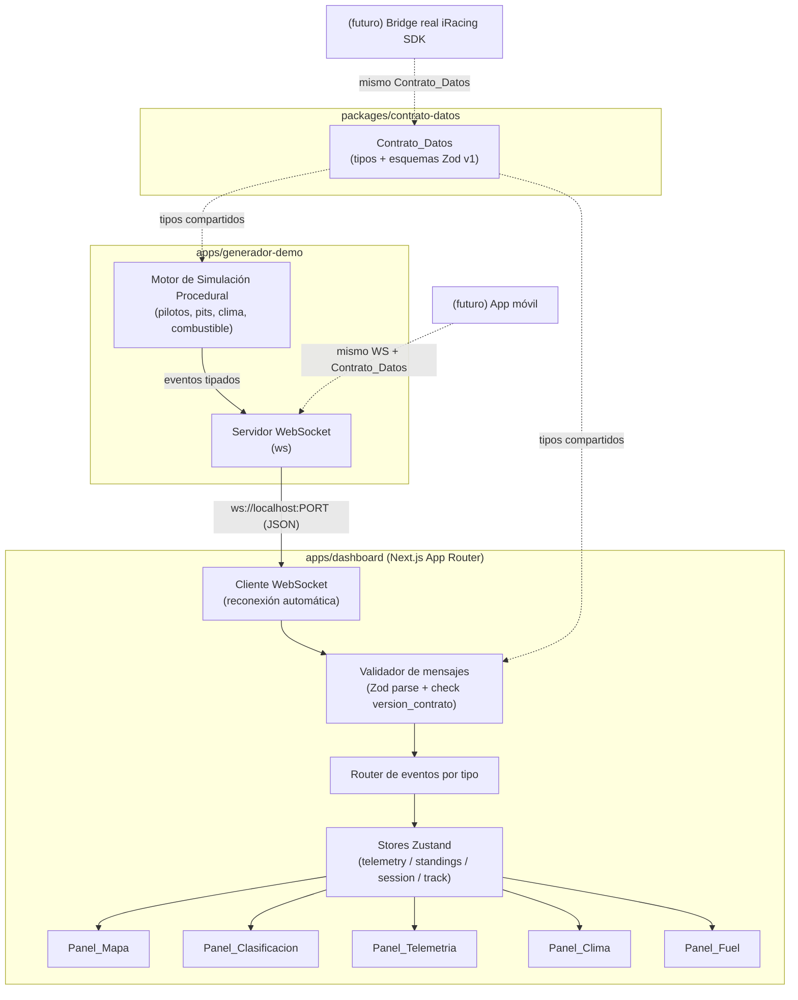
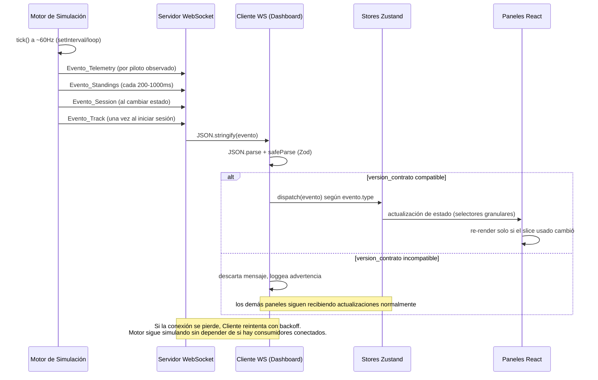
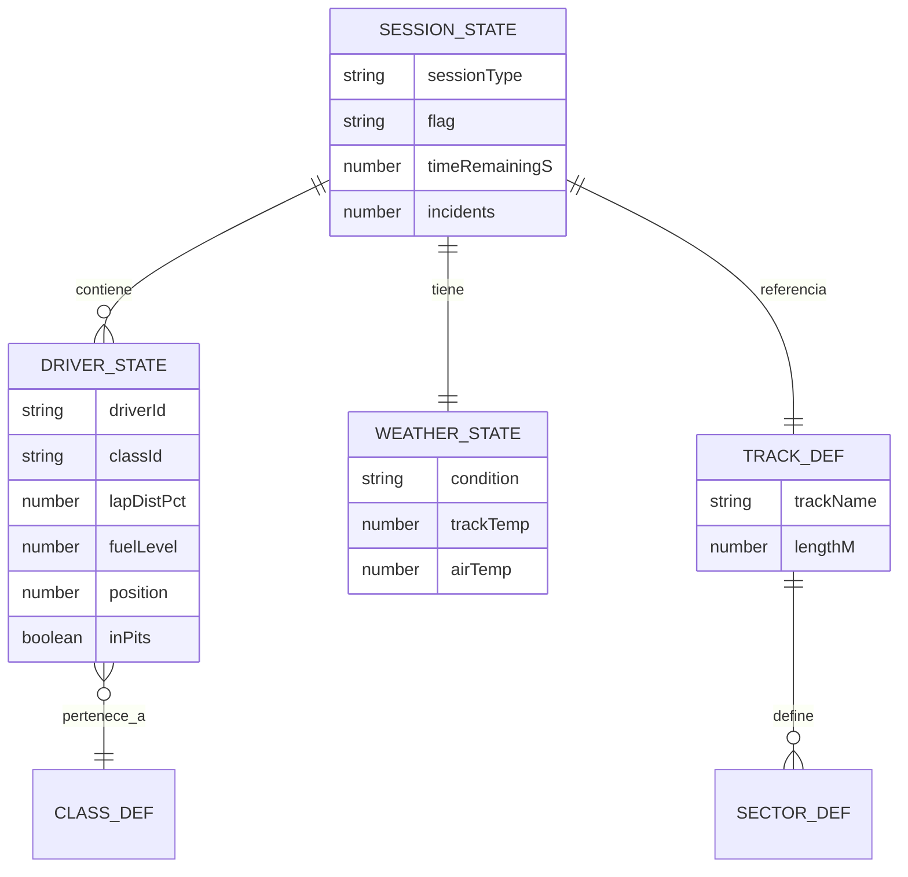

# Documento de Diseño

## Overview

Esta especificación implementa la primera fase de la plataforma de telemetría iRacing como un **monorepo TypeScript** con tres paquetes principales:

1. **`packages/contrato-datos`**: paquete compartido de tipos TypeScript + esquemas [Zod](https://zod.dev/) versionados que definen los cuatro tipos de evento (`telemetry`, `standings`, `session`, `track`). Es el único lugar donde se define la forma de los datos; tanto el Generador_Demo como el Dashboard dependen de él y nunca lo redefinen.
2. **`apps/generador-demo`**: servicio Node.js/TypeScript que ejecuta un motor de simulación procedural en tiempo real y expone un servidor WebSocket local que retransmite los eventos generados, validados contra el Contrato_Datos.
3. **`apps/dashboard`**: aplicación Next.js (App Router) + TypeScript que se conecta al Generador_Demo por WebSocket, valida los mensajes contra el Contrato_Datos y los renderiza en 5 paneles con estética de broadcast de motorsport.

El diseño está pensado explícitamente para que, en fases futuras, un **bridge real del SDK de iRacing** pueda sustituir al Generador_Demo sin cambios en el Contrato_Datos ni en el Dashboard, y para que una **futura app móvil** pueda conectarse al mismo servidor WebSocket y consumir el mismo contrato sin modificaciones. Ninguno de estos dos puntos de extensión se implementa en esta fase; solo se deja la superficie de integración preparada.

### Estructura del monorepo

```
apex-iracing/
├── packages/
│   └── contrato-datos/          # Contrato_Datos: tipos + esquemas Zod versionados
│       ├── src/
│       │   ├── v1/
│       │   │   ├── telemetry.ts
│       │   │   ├── standings.ts
│       │   │   ├── session.ts
│       │   │   ├── track.ts
│       │   │   └── envelope.ts   # union discriminada + validación de versión
│       │   └── index.ts
│       └── package.json
├── apps/
│   ├── generador-demo/           # Generador_Demo (Node.js + ws)
│   │   ├── src/
│   │   │   ├── simulation/       # motor procedural (puro, testeable)
│   │   │   ├── server/           # servidor WebSocket
│   │   │   └── main.ts
│   │   └── package.json
│   └── dashboard/                # Dashboard (Next.js App Router)
│       ├── app/
│       ├── components/
│       ├── lib/
│       │   ├── ws-client/        # cliente WebSocket con reconexión
│       │   └── store/            # Zustand stores
│       └── package.json
├── package.json                  # workspaces (npm/pnpm workspaces)
└── tsconfig.base.json
```

Usar workspaces (npm/pnpm) permite que `generador-demo` y `dashboard` importen `@apex/contrato-datos` como una dependencia normal de TypeScript, sin publicación a un registro, manteniendo un único punto de verdad para el esquema.

## Architecture

### Diagrama de componentes



### Flujo de datos en tiempo real



## Components and Interfaces

### 1. Contrato_Datos (`packages/contrato-datos`)

Es un módulo TypeScript puro (sin dependencias de runtime salvo `zod`) que define:

- Un esquema Zod por tipo de evento, bajo un espacio de nombres versionado `v1`.
- Un tipo TypeScript inferido de cada esquema (`z.infer<typeof TelemetryEventV1Schema>`).
- Un "envelope" común: todo evento tiene `type`, `version_contrato` y `timestamp`.
- Una unión discriminada (`EventoV1`) sobre el campo `type` para que el Dashboard pueda hacer narrowing exhaustivo.
- Una función `isSupportedVersion(version: string): boolean` y `parseEvent(raw: unknown): Result<EventoV1, ContractError>` que encapsula la detección de incompatibilidad de versión **antes** de intentar interpretar el resto del payload.

```typescript
// packages/contrato-datos/src/v1/envelope.ts
import { z } from "zod";

export const SUPPORTED_CONTRACT_VERSIONS = ["1.0.0"] as const;

export const BaseEnvelopeSchema = z.object({
  version_contrato: z.string(),
  timestamp: z.number(), // epoch ms
});

export function isSupportedVersion(version: string): boolean {
  return (SUPPORTED_CONTRACT_VERSIONS as readonly string[]).includes(version);
}
```

```typescript
// packages/contrato-datos/src/v1/telemetry.ts
import { z } from "zod";
import { BaseEnvelopeSchema } from "./envelope";

export const TelemetryEventV1Schema = BaseEnvelopeSchema.extend({
  type: z.literal("telemetry"),
  driver_id: z.string(),
  speed: z.number().nonnegative(),
  rpm: z.number().nonnegative(),
  gear: z.number().int(),
  throttle: z.number().min(0).max(1),
  brake: z.number().min(0).max(1),
  steering: z.number().min(-1).max(1),
  fuel_level: z.number().nonnegative(),
  lap_dist_pct: z.number().min(0).max(1),
  current_lap_time: z.number().nonnegative(),
  last_lap_time: z.number().nonnegative().nullable(),
  best_lap_time: z.number().nonnegative().nullable(),
  delta_to_best: z.number().nullable(),
  delta_to_prev: z.number().nullable(),
  position: z.number().int().positive(),
  track_temp: z.number(),
  air_temp: z.number(),
});

export type TelemetryEventV1 = z.infer<typeof TelemetryEventV1Schema>;
```

```typescript
// packages/contrato-datos/src/v1/standings.ts
import { z } from "zod";
import { BaseEnvelopeSchema } from "./envelope";

export const StandingsEntryV1Schema = z.object({
  driver_id: z.string(),
  position: z.number().int().positive(),
  class_id: z.string(),
  gap: z.number(),
  last_lap_time: z.number().nonnegative().nullable(),
  best_lap_time: z.number().nonnegative().nullable(),
  in_pits: z.boolean(),
  off_track: z.boolean(),
});

export const StandingsEventV1Schema = BaseEnvelopeSchema.extend({
  type: z.literal("standings"),
  drivers: z.array(StandingsEntryV1Schema),
});

export type StandingsEventV1 = z.infer<typeof StandingsEventV1Schema>;
```

```typescript
// packages/contrato-datos/src/v1/session.ts
import { z } from "zod";
import { BaseEnvelopeSchema } from "./envelope";

export const FlagV1Schema = z.enum(["green", "yellow", "red", "checkered", "white"]);
export const WeatherV1Schema = z.enum(["clear", "cloudy", "light_rain", "heavy_rain"]);

export const SessionEventV1Schema = BaseEnvelopeSchema.extend({
  type: z.literal("session"),
  session_type: z.enum(["practice", "qualy", "race"]),
  weather: WeatherV1Schema,
  flag: FlagV1Schema,
  time_remaining_s: z.number().nonnegative().nullable(),
  laps_remaining: z.number().int().nonnegative().nullable(),
  incidents: z.number().int().nonnegative(),
});

export type SessionEventV1 = z.infer<typeof SessionEventV1Schema>;
```

```typescript
// packages/contrato-datos/src/v1/track.ts
import { z } from "zod";
import { BaseEnvelopeSchema } from "./envelope";

export const TrackPointV1Schema = z.object({ x: z.number(), y: z.number() });

export const SectorV1Schema = z.object({
  index: z.number().int().nonnegative(),
  start_pct: z.number().min(0).max(1),
  end_pct: z.number().min(0).max(1),
});

export const TrackEventV1Schema = BaseEnvelopeSchema.extend({
  type: z.literal("track"),
  track_name: z.string(),
  length_m: z.number().positive(),
  path: z.array(TrackPointV1Schema).min(2),
  sectors: z.array(SectorV1Schema).min(1),
});

export type TrackEventV1 = z.infer<typeof TrackEventV1Schema>;
```

```typescript
// packages/contrato-datos/src/v1/index.ts
import { z } from "zod";
import { TelemetryEventV1Schema } from "./telemetry";
import { StandingsEventV1Schema } from "./standings";
import { SessionEventV1Schema } from "./session";
import { TrackEventV1Schema } from "./track";

export const EventoV1Schema = z.discriminatedUnion("type", [
  TelemetryEventV1Schema,
  StandingsEventV1Schema,
  SessionEventV1Schema,
  TrackEventV1Schema,
]);

export type EventoV1 =
  | TelemetryEventV1
  | StandingsEventV1
  | SessionEventV1
  | TrackEventV1;
```

Este paquete no importa nada de `generador-demo` ni de `dashboard`, ni modela conceptos específicos de un futuro bridge del SDK real (Requisito 5.3): solo describe la forma de los mensajes.

### 2. Generador_Demo (`apps/generador-demo`)

Se divide en dos capas independientes para maximizar testabilidad:

**a) Motor de simulación (`src/simulation/`)** — lógica pura, sin I/O, fácil de testear con PBT:

- `SimulationEngine`: mantiene el estado completo de la sesión (`SessionState`: pilotos, clima, bandera, vuelta actual, tiempo restante) y expone `tick(dtMs: number): EventoV1[]`, una función determinística dado el estado actual + un generador de números aleatorios con semilla inyectada (`seed: number`).
- `createDriverState(seed)`, `advanceLap(driver, dtMs)`, `applyFuelConsumption(driver, dtMs)`, `maybeTriggerPitStop(driver, rng)`, `advanceWeather(session, rng)`: funciones puras que transforman el estado, cada una testeable de forma aislada.
- El uso de un PRNG con semilla explícita (p. ej. una implementación tipo `mulberry32` o `xorshift32`) permite que, dada la misma semilla, la secuencia completa de eventos sea reproducible — esto es lo que hace "determinístico/configurable en semilla" al motor sin dejar de ser generación procedural en tiempo real (no se reproduce un archivo grabado; se recalcula el estado en cada tick a partir de reglas y aleatoriedad controlada).

```typescript
// apps/generador-demo/src/simulation/engine.ts
export interface SimulationConfig {
  seed: number;
  driverCount: number;
  classCount: number; // >= 2 para cumplir Requisito 6.7
  trackId: string;
}

export class SimulationEngine {
  private state: SessionState;
  private rng: Rng;

  constructor(config: SimulationConfig) {
    this.rng = createRng(config.seed);
    this.state = createInitialState(config, this.rng);
  }

  /** Avanza la simulación dtMs y devuelve los eventos producidos en este tick. */
  tick(dtMs: number): EventoV1[] {
    const events: EventoV1[] = [];
    advanceDrivers(this.state, dtMs, this.rng);
    applyFuelConsumption(this.state, dtMs);
    maybeTriggerPitStops(this.state, this.rng);
    advanceWeather(this.state, dtMs, this.rng);
    recomputePositions(this.state);

    events.push(buildTelemetryEvent(this.state, this.state.observedDriverId));
    if (this.shouldEmitStandings(dtMs)) events.push(buildStandingsEvent(this.state));
    if (this.hasSessionStateChanged()) events.push(buildSessionEvent(this.state));
    return events;
  }

  /** Se llama una sola vez al iniciar la sesión (Requisito 4.3). */
  buildTrackEvent(): TrackEventV1 {
    return buildTrackEventFromTrackDef(this.state.trackDef);
  }
}
```

**b) Servidor WebSocket (`src/server/`)** — capa de I/O delgada:

- Usa la librería `ws`. Al recibir una nueva conexión, envía inmediatamente el `Evento_Track` de la sesión en curso y comienza a hacer *broadcast* de los eventos generados por el loop del motor (Requisito 7.2).
- El loop de simulación (`setInterval`/`setImmediate` a ~16.6ms) vive fuera del ciclo de vida de cualquier conexión particular: si un cliente se desconecta, el `SimulationEngine` sigue avanzando (Requisito 7.3). El servidor simplemente deja de enviar a ese socket y sigue enviando a los demás.
- No depende de ningún addon nativo ni de acceso a memoria compartida de Windows (Requisito 7.4): es Node.js + `ws` puro.

```typescript
// apps/generador-demo/src/server/wsServer.ts
import { WebSocketServer } from "ws";

export function startServer(engine: SimulationEngine, port: number) {
  const wss = new WebSocketServer({ port });
  const trackEvent = engine.buildTrackEvent();

  wss.on("connection", (socket) => {
    socket.send(JSON.stringify(trackEvent));
  });

  setInterval(() => {
    const events = engine.tick(16.6);
    const payload = events.map((e) => JSON.stringify(e));
    for (const socket of wss.clients) {
      for (const msg of payload) socket.send(msg);
    }
  }, 16.6);

  return wss;
}
```

### 3. Dashboard (`apps/dashboard`)

**a) Cliente WebSocket (`lib/ws-client/`)**

- Envoltura sobre `WebSocket` nativo del navegador con reconexión automática (backoff exponencial acotado) y una única responsabilidad: recibir texto, parsear JSON, y pasar el resultado crudo a un validador.
- El validador usa `EventoV1Schema.safeParse` **después** de comprobar `isSupportedVersion(raw.version_contrato)`. Si la versión no es soportada, el mensaje se descarta y se emite un log de advertencia, sin lanzar excepción ni afectar a los demás paneles (Requisitos 5.4 y 14.4).

```typescript
// apps/dashboard/lib/ws-client/client.ts
export function createWsClient(url: string, onEvent: (e: EventoV1) => void) {
  let socket: WebSocket | null = null;
  let retryDelayMs = 500;

  function connect() {
    socket = new WebSocket(url);
    socket.onmessage = (msg) => handleRawMessage(msg.data, onEvent);
    socket.onclose = () => {
      setTimeout(connect, retryDelayMs);
      retryDelayMs = Math.min(retryDelayMs * 2, 8000);
    };
    socket.onopen = () => { retryDelayMs = 500; };
  }

  connect();
  return { close: () => socket?.close() };
}

function handleRawMessage(raw: string, onEvent: (e: EventoV1) => void) {
  let parsed: unknown;
  try { parsed = JSON.parse(raw); } catch { return; }

  const versionCheck = (parsed as { version_contrato?: string })?.version_contrato;
  if (typeof versionCheck !== "string" || !isSupportedVersion(versionCheck)) {
    console.warn("Evento descartado: version_contrato incompatible", versionCheck);
    return;
  }

  const result = EventoV1Schema.safeParse(parsed);
  if (!result.success) { console.warn("Evento descartado: no cumple el schema"); return; }
  onEvent(result.data);
}
```

**b) Router + Stores (`lib/store/`)**

- Un único `dispatchEvent(e: EventoV1)` hace narrowing exhaustivo sobre `e.type` y delega al store correspondiente (Requisito 14.2). Nunca un evento de un tipo actualiza el store de otro tipo.
- Se usa **Zustand** con stores separados por tipo de evento (`useTelemetryStore`, `useStandingsStore`, `useSessionStore`, `useTrackStore`) para que los componentes puedan suscribirse con selectores finos (`useTelemetryStore(s => s.throttle)`) y evitar re-renders de paneles que no dependen de ese slice.
- Estrategia de rendimiento a 60Hz (Requisito 15):
  - **Batching**: los eventos telemetry que llegan dentro de la misma vuelta de animación (`requestAnimationFrame`) se acumulan en un buffer y el store se actualiza una sola vez por frame, no una vez por mensaje de red.
  - **Refs directos para el gráfico**: el `Panel_Telemetria` mantiene el buffer de puntos del trace en un `useRef` (array circular) y dibuja con el canvas/SVG imperativamente en cada `requestAnimationFrame`, evitando que React re-renderice el árbol de componentes a 60Hz. Solo valores agregados de baja frecuencia (delta actual, vuelta seleccionada) pasan por estado de React.
  - **Selectores granulares + `React.memo`**: cada panel se suscribe solo a los slices de Zustand que necesita, y los subcomponentes puramente presentacionales se memoizan para que un cambio en `standings` no re-renderice `Panel_Clima`.
  - **Throttling de renders derivados**: valores que no necesitan 60Hz visualmente (p. ej. Panel_Fuel, Panel_Clima) se actualizan en el store a la frecuencia de llegada, pero el componente usa un `useSyncExternalStore` con muestreo a ~10Hz para el re-render visual.

**c) Paneles (`components/panels/`)**

| Panel | Fuente de datos | Librería clave |
|---|---|---|
| Panel_Mapa | `track` (una vez) + `telemetry`/`standings` (posiciones) | SVG propio o `visx` para proyectar `lap_dist_pct` sobre el `path` del circuito |
| Panel_Clasificacion | `standings` | shadcn/ui `Table` + Framer Motion para reordenar filas |
| Panel_Telemetria | `telemetry` (buffer por vuelta) | `visx`/`Recharts` para ejes, dibujo imperativo del trace en `<canvas>` |
| Panel_Clima | `session` + `telemetry` (temperaturas) | shadcn/ui cards |
| Panel_Fuel | `telemetry` (fuel_level, historial) | shadcn/ui + gráfico simple de barra/gauge |

- Layout modular por tabs (Requisito 8): shadcn/ui `Tabs` en el layout raíz de `app/`, cada panel es una ruta/segmento independiente o un `TabsContent` perezoso (`dynamic import`) para no montar los 5 paneles simultáneamente si no es necesario.
- Estética (Requisito 16/17): tema oscuro vía Tailwind `dark` + variables CSS custom de theming neón sobre shadcn/ui; tipografía condensada tipo HUD (p. ej. `font-mono` con letter-spacing ajustado o una fuente condensada como "Titillium Web"/"Chakra Petch") aplicada a los valores numéricos vía una clase utilitaria `.hud-number`; animaciones de transición de tabs y de reordenamiento de la tabla de clasificación con Framer Motion.

## Data Models

Los modelos de datos son exactamente los esquemas Zod descritos en la sección de Contrato_Datos. Relación entre entidades del dominio de simulación (no expuestas directamente, son estado interno del motor que se proyecta a los `EventoV1` mostrados arriba):



`SessionState` (estado interno del motor) se proyecta hacia los cuatro `EventoV1` mediante funciones puras `buildTelemetryEvent`, `buildStandingsEvent`, `buildSessionEvent`, `buildTrackEvent`, que son precisamente las funciones sujetas a las propiedades de corrección de la siguiente sección.

## Error Handling

| Escenario | Manejo |
|---|---|
| Mensaje WebSocket no es JSON válido | El cliente descarta el mensaje silenciosamente (log de advertencia), no se propaga excepción a React. |
| `version_contrato` no soportado | Se detecta antes de intentar `safeParse` del resto del payload (Requisito 5.4); el mensaje se descarta y los demás paneles siguen actualizándose con normalidad (Requisito 14.4). |
| Mensaje con `version_contrato` soportado pero que no cumple el schema Zod del tipo declarado | `safeParse` falla, se descarta el mensaje y se loggea el `ZodError` para diagnóstico, sin lanzar excepción. |
| Conexión WebSocket perdida (cliente) | Reconexión automática con backoff exponencial acotado (Requisito 14.3); el estado de los stores se conserva mientras se reconecta. |
| Conexión WebSocket perdida (servidor, un cliente se desconecta) | El `SimulationEngine` no depende de sockets activos; sigue el loop de simulación sin interrupción (Requisito 7.3). |
| Consumo de combustible llega a 0 o por debajo | `applyFuelConsumption` fija un piso en 0 (`Math.max(0, fuel - consumo)`); nunca se emite `fuel_level` negativo. |
| Estimación de vueltas restantes con consumo por vuelta ≈ 0 | `estimateRemainingLaps` devuelve `Infinity` de forma explícita en vez de dividir por cero o lanzar excepción; el Panel_Fuel muestra "—" cuando el valor es `Infinity`. |
| Motor de simulación con configuración inválida (p. ej. `driverCount <= 0`) | `SimulationEngine` valida la config en el constructor y lanza un error descriptivo al arrancar el servicio (fail-fast en el proceso Node, no en tiempo de request). |

## Punto de extensión: futuro bridge real y futura app móvil

Este diseño aísla deliberadamente tres capas para que sean sustituibles de forma independiente:

- **Contrato_Datos** es agnóstico de la fuente: no importa nada de `generador-demo`. Un futuro `apps/bridge-iracing-sdk` podría implementar la misma interfaz `tick(): EventoV1[]` (o emitir directamente al mismo protocolo WebSocket) leyendo memoria compartida del SDK real de iRacing, sin tocar `contrato-datos` ni `dashboard`.
- El **protocolo de transporte** (WebSocket local + JSON serializado según `EventoV1Schema`) es el mismo que consumiría una futura app móvil (p. ej. React Native/Expo): solo necesitaría reutilizar `packages/contrato-datos` y una versión del cliente WebSocket equivalente a `lib/ws-client`.
- Ninguna lógica de UI del Dashboard asume que el emisor es el Generador_Demo: todo el consumo pasa por la validación de `version_contrato` y el schema, por lo que cualquier emisor conforme al contrato es intercambiable.

No se implementa código de bridge real ni de app móvil en esta fase; el diseño solo garantiza que ambos puntos de extensión no requerirán cambios en `contrato-datos` y consumirán el mismo protocolo WebSocket ya construido para el Dashboard.

## Correctness Properties

*A property is a characteristic or behavior that should hold true across all valid executions of a system-essentially, a formal statement about what the system should do. Properties serve as the bridge between human-readable specifications and machine-verifiable correctness guarantees.*

### Property 1: Conformidad de todo evento con el Contrato_Datos

Para cualquier evento emitido por el Generador_Demo (de cualquiera de los cuatro tipos, con cualquier estado interno de sesión alcanzable), dicho evento SHALL validar sin errores contra el esquema Zod correspondiente a su campo `type`, incluyendo la presencia de `version_contrato` y `timestamp`, y los tipos numéricos correctos en todos sus campos.

**Validates: Requirements 1.1, 1.2, 1.4, 2.1, 2.2, 3.1, 3.2, 4.1, 4.2, 5.2, 6.8**

### Property 2: Filtrado correcto por version_contrato

Para cualquier mensaje recibido (con `version_contrato` soportado o no, y con payload válido o inválido para su tipo declarado), la función de recepción SHALL clasificar el mensaje como incompatible si y solo si su `version_contrato` no está en el conjunto de versiones soportadas, y SHALL descartarlo sin producir ningún efecto observable sobre el estado de los demás stores/paneles cuando así ocurra.

**Validates: Requirements 5.4, 14.4**

### Property 3: Emisión de Evento_Session ante cualquier cambio de estado global

Para cualquier secuencia de cambios inyectados en el estado global de la sesión (tipo de sesión, clima, bandera, tiempo/vueltas restantes o incidentes), el motor de simulación SHALL producir un nuevo Evento_Session cuyo contenido refleje el nuevo estado, y SHALL no producir un Evento_Session cuando ninguno de esos campos cambia entre dos ticks consecutivos.

**Validates: Requirements 3.3**

### Property 4: Exactamente un Evento_Track por sesión

Para cualquier configuración válida de sesión (cualquier semilla, número de pilotos y duración simulada), la secuencia completa de eventos producidos por el Generador_Demo durante esa sesión SHALL contener exactamente un Evento_Track.

**Validates: Requirements 4.3**

### Property 5: Determinismo por semilla del motor de simulación

Para cualquier semilla dada, dos ejecuciones independientes del motor de simulación con esa misma semilla y la misma secuencia de `dtMs` SHALL producir exactamente la misma secuencia de eventos; y para dos semillas distintas, las secuencias de eventos producidas SHALL diferir en al menos un evento (dentro de una ejecución de longitud suficiente).

**Validates: Requirements 6.1**

### Property 6: Avance continuo y acotado de lap_dist_pct

Para cualquier piloto en pista y cualquier par de eventos de telemetría consecutivos de ese piloto sin una parada en pits entre ambos, `lap_dist_pct` del evento posterior SHALL ser mayor que el del evento anterior, o SHALL haber completado una vuelta (salto de un valor cercano a 1 a un valor cercano a 0); y en todo evento, `lap_dist_pct` SHALL estar siempre en el rango [0, 1).

**Validates: Requirements 6.2, 1.1**

### Property 7: Combustible no negativo y monótonamente no creciente sin pit stop

Para cualquier piloto en pista y cualquier par de eventos de telemetría consecutivos de ese piloto sin una parada en pits entre ambos, `fuel_level` del evento posterior SHALL ser menor o igual al del evento anterior; y en todo evento de telemetría, `fuel_level` SHALL ser siempre mayor o igual a 0.

**Validates: Requirements 6.5**

### Property 8: Unicidad y rango de posiciones en Evento_Standings

Para cualquier Evento_Standings generado con N pilotos, el conjunto de valores de `position` de todos los pilotos SHALL ser exactamente el conjunto de enteros {1, ..., N}, sin duplicados y sin huecos.

**Validates: Requirements 2.1**

### Property 9: Mapeo geométrico consistente de progreso de vuelta

Para cualquier trazado válido (definido por su `path` y sus `sectors`) y cualquier valor de `lap_dist_pct` en [0, 1), la función que proyecta dicho progreso sobre un punto del trazado SHALL devolver siempre un punto derivado por interpolación entre puntos existentes del `path` (nunca fuera de sus límites), y la función que determina el sector SHALL devolver siempre un índice de sector válido definido en `sectors`, siendo consistente en los valores límite entre sectores adyacentes.

**Validates: Requirements 9.2, 9.3**

### Property 10: El view-model de clasificación preserva los datos y agrupa por clase

Para cualquier Evento_Standings válido, el view-model derivado para el Panel_Clasificacion SHALL contener, para cada piloto presente en el evento original, exactamente los mismos valores de posición, clase, gap, última vuelta, mejor vuelta y estado de pits/fuera de pista; y el orden/agrupamiento resultante SHALL ubicar de forma contigua a todos los pilotos que comparten la misma clase.

**Validates: Requirements 10.1, 10.2**

### Property 11: La serie de telemetría preserva orden, longitud y fidelidad del delta

Para cualquier secuencia de N eventos de telemetría de una misma vuelta, la función que construye la serie del Panel_Telemetria SHALL producir una serie de longitud N que preserva el orden de llegada, donde cada punto mapea `lap_dist_pct` al eje X y `throttle`/`brake` al eje Y sin alterar sus valores, y el delta de sector mostrado para cada punto SHALL ser idéntico al valor de `delta_to_best`/`delta_to_prev` del evento fuente correspondiente.

**Validates: Requirements 11.1, 11.2**

### Property 12: La Vuelta_Referencia seleccionada es invariante ante nuevas telemetrías

Para cualquier Vuelta_Referencia seleccionada y cualquier secuencia posterior de nuevos Evento_Telemetry recibidos, el identificador de la Vuelta_Referencia almacenado en el estado SHALL permanecer sin cambios hasta que el usuario seleccione explícitamente una Vuelta_Referencia distinta.

**Validates: Requirements 11.4**

### Property 13: La estimación de vueltas restantes de combustible es total y no negativa

Para cualquier `fuel_level` mayor o igual a 0 y cualquier tasa de consumo por vuelta derivada del historial (incluyendo una tasa igual a 0), la función que estima las vueltas restantes SHALL devolver siempre un valor definido mayor o igual a 0 (usando `Infinity` de forma explícita cuando la tasa de consumo es 0), sin lanzar una excepción para ningún valor de entrada válido.

**Validates: Requirements 13.2**

### Property 14: El estado derivado del store siempre refleja el último evento recibido por tipo

Para cualquier secuencia de eventos válidos recibidos por el Dashboard, el estado almacenado en el store correspondiente a cada tipo de evento (`standings`, `session`, `telemetry`) SHALL ser siempre igual al resultado de aplicar la función de transformación de dicho tipo al último evento válido recibido de ese tipo, independientemente del orden de llegada de eventos de otros tipos.

**Validates: Requirements 10.3, 12.3, 13.3**

### Property 15: El enrutamiento de mensajes dirige cada evento exactamente a su handler por tipo

Para cualquier evento válido de alguno de los cuatro tipos, la función de despacho del Dashboard SHALL invocar exactamente el handler/store correspondiente a ese `type`, y SHALL no invocar ningún otro handler/store para ese evento.

**Validates: Requirements 14.2**

## Testing Strategy

**Enfoque dual**: se combinan tests basados en propiedades (PBT) para la lógica pura y de alto valor de variación (motor de simulación, transformaciones de datos, validación de contrato) con tests de ejemplo/integración para comportamiento existencial, de infraestructura, temporización y UI concreta.

**Property tests** (mínimo 100 iteraciones cada uno, usando `fast-check` en TypeScript):
- Property 1 a 15 descritas arriba, implementadas contra las funciones puras correspondientes (`buildTelemetryEvent`, `buildStandingsEvent`, `parseEvent`, `estimateRemainingLaps`, `lapPctToPoint`, `getSectorForLapPct`, reducers de los stores de Zustand, etc.).
- Etiquetado de cada test: `Feature: iracing-telemetry-platform, Property N: <texto de la propiedad>`.

**Unit / example tests**:
- Requisito 6.3/6.4/6.6/6.7: ejecutar una sesión simulada completa (semilla fija) y verificar que ocurre al menos un cambio de posición, al menos una parada en pits, al menos un cambio de condición climática, y que hay pilotos de al menos 2 clases configuradas.
- Requisito 8.2, 9.1, 12.1, 12.2, 13.1: renderizado de cada panel con un estado fijo de ejemplo, verificando presencia de los campos requeridos en el DOM.
- Requisito 11.3: seleccionar una Vuelta_Referencia concreta y verificar que se superpone su trace.

**Integration tests** (infraestructura, no aptos para PBT):
- Requisito 1.3/2.3: medir el intervalo medio entre eventos telemetry/standings emitidos durante una ejecución corta y verificar que cae dentro de una tolerancia alrededor de 60Hz / 1-5Hz.
- Requisito 7.1/7.2/7.3: levantar el servidor WebSocket real (puerto efímero), conectar un cliente de prueba, verificar recepción del Evento_Track inicial, y verificar que tras cerrar el socket el proceso del motor sigue avanzando (por ejemplo, reconectando y comprobando que el estado interno progresó).
- Requisito 14.1/14.3: mock del `WebSocket` global para verificar que el cliente intenta conectar al montar la app y que reintenta tras un `onclose`.

**Smoke tests** (configuración, ejecución única):
- Requisito 7.4: el proceso del Generador_Demo arranca y escucha en el puerto configurado usando solo Node.js + `ws`, sin dependencias nativas adicionales.
- Requisito 8.1/8.3/17.1-17.6: verificación de que el proyecto usa las dependencias/stack declarado (chequeo de `package.json` / build exitoso con Next.js App Router + TypeScript).

**No aptos para testing automatizado** (validados por revisión manual/diseño): Requisitos 5.1, 5.3, 7.4 (aspecto arquitectónico), 8.1 (aspecto de organización), 15.1/15.2 (percepción de fluidez, requieren profiling manual), 16.1-16.3 (estética subjetiva).
